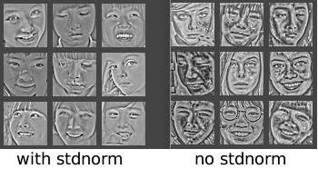

__Data Normalization__
==============    
本篇主要讨论一些常用的数据归一化方法，以及其相应的影响。这里全部基于2-d的图像来讨论。          
     

__DC Removal__
------    
---
*  __原理__    
DC(dirrect current)来源于电子工程中的直流电。简单点的说就是移除本身的均值，其使得`整张图像的均值为0`，如下:    
$$
\hspace{8mm}\widetilde{I}(x,y) = I(x,y) - \frac{1}{W \times H}\sum_{x^{'},y^{'}}I(x^{'},y^{'}) \\
\hspace{16mm}其中:    \\ 
\hspace{20mm}公式中的第二项就是整张图像的均值
$$   
* __作用__    
coming soon    
     

__Mean Normalizetion__
------    
---
*  __原理__    
均值归一化就是使`每个位置的像素的均值为0`(注意其和DC Removal的区别)。如下:    
$$
\hspace{8mm}\widetilde{I}(x,y) = I(x,y) - \mu(x,y) \\
\hspace{16mm}其中:    \\ 
\hspace{20mm}\mu(x,y) = \frac{1}{N}\sum_{n=1}^{N}I_n(x,y)
$$   
* __作用__    
coming soon    
     

__STD Normalizetion__
------    
---
*  __原理__    
标准差归一化就是使`每个位置的像素的均值为0且其每个位置像素的方差为1`(其就是在均值归一化后再除以每个位置像素的标准差)。如下:    
$$
\hspace{8mm}\widetilde{I}(x,y) = \frac{I(x,y) - \mu(x,y)}{\sigma(x,y)} \\
\hspace{16mm}其中:    \\ 
\hspace{20mm}\sigma(x,y) = \sqrt{\frac{1}{N}\sum_{n=1}^{N}(I_n(x,y) - \mu(x,y))^2}
$$   
* __作用__    
coming soon    
     

__SCN(Spatial constractive Normalization)__
------    
---    
*  __原理__  
详细分析见renference[2]和[3]，其步骤如下如下:     
$$
\hspace{8mm}\widetilde{I}(c,x,y) = \frac{V(c,x,y)}{max(const, \sigma_{x,y})}  \hspace{4mm}（1）\\ 
\hspace{16mm}其中: \\
\hspace{20mm}V(c,x,y) = I(c,x,y) - \sum_{c,x,y}W_{x,y}I_{c,x+p,y+q} \hspace{4mm} (2)\\ 
\hspace{20mm}c : 为通道索引  \\
\hspace{20mm}\sum_{c,x,y}W_{x,y} = 1 (一般取高斯核)  \\
\hspace{20mm}\sigma_{x,y} = \sqrt{\sum_{c,x,y}W(x,y)V^2_{c,x+p,y+q}}  \\ 
\hspace{20mm}const = mean(\sigma_{x,y})(此时这个值需要在一个大的数据集上计算出来或者直接取个常数如1)
$$    
* __细节__    
1.  `需要消除边缘效应`      
在式(1)和(2)中$$W_x,y$$应用在图像边缘时，其外面是补0的。因此边缘处的$$V$$与$$\sigma$$要较中间部分的小。可以乘以一个权重因子进行补偿    
2.  `在做SCN之前先做标准差归一化后，效果比较平滑，否则会有噪声`    
因为Std Norm将每个位置的数据方差归一化到了1，压制住了噪声，效果如下:    
    

     

__Reference__
-------    
--- 
1.  [Natural Image Statistics](http://www.naturalimagestatistics.net/)(Chapter 5)           
2.  Pinto, Cox. Why is real-world vi- sual object recognition hard? 2008
3.  Lyu, Simoncelli. Nonlinear image representation using divisive normalization. 2008.
