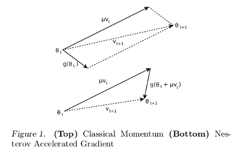
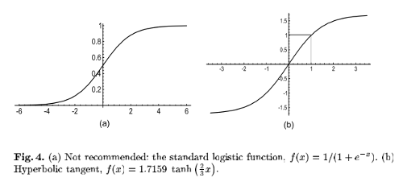

__Training Tricks for Neural Network__
========
本文主要就Neural Network的一些训练技巧进行简单的总结    
 

__Stochastic versus Batch learning__     
----------    
---   
    
### __一. Pros of Stochastic Learning__     
1.  __学习过程比Batch Learning快__      
假设样本集中有10个样本，然后每个样本生成9个自身的copy，这样就有100个样本。
Stochastic只需要10个样本就完成了一个epoch。
而Batch则需要计算100个样本才能完成一次epoch`(而且其中90次是无用的计算)`    
2.  __学习的效果一般比较好__      
因为Stochastic的过程比较振荡，容易跳过一些局部最小值，找到更好的局部最小值。`而Batch在初始参数定了以后其最终的局部最小值就定了`
3.  __可以用来跟踪学习样本的变化__       
样本的变化，会立即反应到训练中，这也是其另一个名字Online Lerning的由来

###  __二. Pros of Batch Learning__     
1.  __学习的过程比较平稳__    
Batch的学习过程比较平稳，容易收敛，而Stochastic比较振荡，因此一般Stochastic的学习率都比较小。可以采用mini-batch来折衷，`既可以跳过局部最小，也可以相对平稳`      
2.  __一些加速算法只能用在Batch模式下(如:conjugate gradient，hessian-based)__   
可以现基于训练集学习得到一些加速算法需要的参数，再应用到Stochastic方法中，但是在Online就不行了(因为没有提前准备好的数据集)。  
 

__Momentum__
--------    
---    
*  __CM(Classical Momentum)__    
$$
\hspace{8mm}v_{t+1} = \mu v_t - \epsilon f^{'}(\theta _t) \\
\hspace{8mm}\theta_{t+1} = \theta_t + v_{t+1}  
$$    
	
*  __NAG(Nesterov Accelerated Gradient)__    
$$
\hspace{8mm}v_{t+1} = \mu v_t - \epsilon f^{'}(\theta _t + \mu v_t) \\
\hspace{8mm}\theta_{t+1} = \theta_t + v_{t+1}  
$$   
其两者的图形比较如下:    
    

1.  文章[2]中Ilya Stutskever使用文章[4]中Sparse Inilitialization，加上NAG达到了文章[4]中的HF的优化效果。
2.  文章[2]中还指出尤其在$$\mu$$比较大时，NAG的效果更好
3.  bingo在文章[3]中又对NAG进行了进一步的解释(TODO::看一下)    
 

__Weights Initialization__
--------    
---    
*  __Lecun's Advice__    
$$
\hspace{8mm}stdv = 1/math.sqrt(L_{total_input_num})  \\
\hspace{8mm}w = torch.uniform(-stdv, stdv)
$$

*  __Andrew's Advice__    
$$
\hspace{8mm}epsilon = \sqrt{6}/\sqrt{L_{out}+L_{in}}  \\
\hspace{8mm}w = torch.uniform(-epsilon, epsilon)
$$
这里以输入层与一个隐层为例，$$L_{in}$$与$$L_{out}$$,是指神经网路的整个输入节点数，与与之相连的整个隐层的节点数。这里只适合全链接，不过还是上面的方法通用一点    

*  __Sparse Initialization__       

 

__Input Processing__
--------    
---         
详细分析见文章[1]    

*  `每次epoch都shuffle一下训练集`    
神经网路只有在没遇到的训练样本下，学习才会很快， 因此当很多类似的样本在一起时，会降低网路的学习速度    

*  [remove DC](./data-normalization.html#dc-removal)    
注意[mean normalize]也有remove DC的作用。举个极端的例子，当一个输入样本的所有值都为正时，这是与输入相连的一个节点的所有权重的更新为$$\delta \vec x$$([Delta rule](./backpropagation.html)),$$\vec x$$为输入变量。我们发现所有的权重的更新值的符号都是相同。也就是说权重只能通过zigzagging来改变方向。导致学习没有效率

*  [std normalize](./data-normalization.html#std-normalizetion)    
每一维的特征均值的方差为都拥有相同的方差。这样就把所有的特征的信息scale到同一个尺度上面了(不会有哪个特征重要，哪个特征不重要的情况发生)。`当然这样做也有不好的地方，就是当知道哪些特征不重要时(其方差就应该比其他特征低一些)`

*  [whiten](./whiten.html#whiten)    
每一维的特征之间不相关。（TODO:: 具体分析没看明白？）    
     

__Active Function__
--------    
---    
如下图:    
    

1. 一般建议使用左图的`hyperbolic tangent`函数，其输出关于原点对称。且其有效增益(即输出与输入的比为增益)为1，因此其输出值的方差接近1。符合[样本处理中输入均值为0，且拥有相同方差的需求](./nn-train-tricks.html#input-processing)的分析       
2. `hyperbolic tangent`函数的缺点是，其error surface在0点(0点初值为0，其变动比较小)与两个极端点初比较平坦， 即其有3个饱和的区域(左图只有在两端饱和)。 `因此在参数初始化时，应避免参数的值比较小，落入到`hyperbolic tangent`的0点附近的饱和区`    
     

__Learning Rate__
--------    
---    
*  每个权重都应有自己各自的学习率(所有2介导数的方法的目标)    
*  神经网路的越是前几层的，其参数的学习率越要大    
*  权重的学习率应该和节点的`输入单元的个数的平方差`成正比

 

__References__
--------    
---    

1.  Efficient BackProp    
2.  On the importance of initialization and momentum in deep learning
3.  Advances in Optimizing Recurrent Networks
4.  Deep learning via Hessian-free optimization

