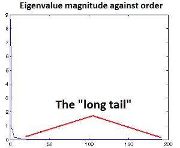

数据白化whitening(也称为球化sphering)，学习之UFLDL（http://deeplearning.stanford.edu/wiki/index.php/Whitening）

__PCA_Whiten__
------------    
---        
__步骤__    
    
1.  计算数据的协方差矩阵M，并计算协方差矩阵的特征向量矩阵U和特征值向量λ    
2.  将数据进行PCA投影，即$$X_{rot}=U^TX_{ori}$$    
3.  使投影后的数据拥有单位方差，即$$X_{PCAWhiten,i}=\frac{X_{rot,i}}{\sqrt{\lambda_i+\epsilon}}$$ (ϵ起到一个低通滤波的功能)    
4.  `[Optional]`在第2步的数据投射时，可以进行降维操作      
         
__ϵ的选择__    

*   估计的方法        
1.  当数据$$X_{rot} \in [−1,1]$$时， $$\epsilon \simeq 10^{-5}$$    
2.  当数据$$X_{rot} \in [0,255]$$时， $$\epsilon \simeq 0.1$$    
*   分析的方法    
将λ按大小画出下图，其\episilon大于大多数比较小的特征值，即最好消除途中的`Long tail`    
    
 

__ZCA_Whiten__
------------    
---    
__方法__    
将PCA whiten后的数据反投射到原始的数据空间坐标，即$$X_{ZCAWhiten}=UX_{PCAWhiten}$$      
  
__Tips__   

*   U是正交矩阵，即$$U^TU=UU^T=I$$    
*   进行ZCA Whiten的时候， 在PCA Whiten步骤中不做降维操作
