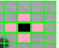

Hog是一种__局部特征__，由Dalal和Triggs在文章[1]中提出，并使用在行人检测中.

#### __步骤__
---

> 1. 图像灰度化
> 2. gamma矫正(影响不大可省略, 即$$I(x,y)=I(x,y)^{gamma}$$) 
> 3. 将图像划分成小的cell(如6x6)单元，统计cell的梯度方向直方图
> 4. 基于cell组成block，相邻的block之间的cell可以有重叠,将block内所有cell的直方图合并在一起，并进行归一化，得到局部block的特征（`最终的特征维数为：(block的个数)X(block内的cell个数)X(方向bin的大小`）

#### __实现细节__    
--- 

* __cell梯度方向直方图统计__    
`使用三次插值，即角度、X、Y方向的插值`效果最好        
1. __其角度方向插值__   
    
如上图，85度其有1/4在70bin中，3/4在90bin中，`且采用循环模式，即0度有1/2在10bin中，1/2在170bin中`    
2. __X，Y方向的插值__    
    
上图中黑色cell内的像素点对其上下左右4个cell都有贡献, __`注意边缘处cell的值需要进行补偿`__

* __block的划分__    
    
1. (左图)每个block由4个cell组成，一个block特征由4个cell直方图组成(`block的维数比cell少1`)，并归一化
2. (右图)每个cell使用不同block的模值归一化，生成4个直方图合并block的特征（`block的维数与cell相等`）

* __block内直方图的归一化__    
1. `L1-norm`     
$$\vec{v} = \vec{v}/(|\vec{v}|_1+\epsilon)$$     
2. `L1-sqrt`     
$$\vec{v} = \sqrt{\vec{v}/(|\vec{v}|_1+\epsilon)}$$     
3. `L2-norm`    
$$\vec{v} = \vec{v}/\sqrt{|\vec{v}|^2_2+\epsilon^2}$$      
4. `L2-Hys(效果最好)`      
先进行L2-norm操作,然后执行$$v_i=MIN(v_i, th)$$, th一般为0.2    

#### __注意事项__    
--- 
* 求梯度前不要进行模糊操作，`如Gaussian、Median等，其会严重影响性能`    
* 求梯度模板越简单越好，文章中使用`[-1, 0, 1]`效果最好,即:    
$$
G_x (x,y)=I (x+1,y)-I (x-1,y)  \\    
G_y (x,y)=I (x,y+1)-I (x,y-1)
$$

#### __References__
---
1. Histograms of Oriented Gradients for Human Detection
