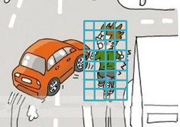

`ICF`是[Piotr Dollar](http://vision.ucsd.edu/~pdollar/research.html)于2009年在文章[1]中提出的。其将所有可以通过积分图计算的特征统称为`ICF`。其文章中实验表明使用`LVU, HOG, 梯度幅值`10个channel的特征(其中hog使用6个bin)在`行人检测`中效果最好:    

1. `LUV、梯度幅值`上可以使用`一阶`(即正方形区域内值的和)或`二阶`(如haar-like, 不同区域之间的差)`
2. [HOG](./hog.html)文章中使用6个方向，这样HOG可以通过6个直方图来计算，每个直方图计算一个方向    
 

#### __ACF (Aggregate Channel Features)__
---
`ACF`是[Piotr Dollar](http://vision.ucsd.edu/~pdollar/research.html)于2014年在文章2中提出的，其采用ICF中使用的`LVU, HOG, 梯度幅值`10个channel,但只使用`一阶特征`(即矩形区域内值的和)。    

__例如__    
    
图像中目标区域为32x64时，将其划分为8x8的cell，则此时目标区域被划分成4x8的cell，只使用cell内值的和作为特征，则此时目标区域内的总特征维数为4x8x10。__检测时__，先算好整张图像的特征图，然后在特征图上进行窗口扫描(即`feature-centric`)。`缺点是其在特征图上的扫描相当于在原图上使用步长为8(即cell大小)进行扫描`

#### __References__
---
1. Integral Channel Features (2009)    
2. Fast Feature Pyramids for Object Detection (2014)
3. Fast Human Detection Using a Cascade of Histograms of Oriented Gradients (2006)
