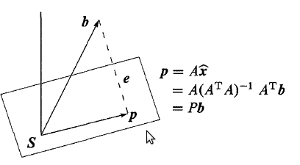

__Linear Algebra__
------------------
学习的是MIT的`Introduction to Linear Algebra(Gilbert Strang)`，其[公开课的视频](http://v.163.com/special/opencourse/daishu.html)可以在网易公开课上找到。个人人为其是线性代数的最好(没有之一)的教程了
       

__第一章(Introduction to Vectors)要点__
------------
---
* __矩阵与向量的相乘用矩阵列空间的线性组合来表示__    
$$
\left(\begin{array}{c}1&2&9\\3&4&2\\2&5&0\end{array}\right)*
\left(\begin{array}{c}1\\2\\3\end{array}\right)=
1*\left(\begin{array}{c}1\\3\\2\end{array}\right)+
2*\left(\begin{array}{c}2\\4\\5\end{array}\right)+
3*\left(\begin{array}{c}9\\2\\0\end{array}\right)
$$    
       

__第二章(Solving Linear Equations)要点__
------------
---
* __高斯消元__   
将矩阵转换成上三角矩阵U
* __通过Gauss-Jordan消元求逆矩阵__。    
理论依据为$$A^{-1}[A\hspace{4mm}I] = [I\hspace{4mm}A^{-1}]$$
* __A=LU分解__。    
任意一个矩阵都可以进行LU分解。其中L是主对角线上元素为1的下三角矩阵，U为上三角矩阵，`其主对交线上的元素为pivot`。有时候其分解需要进行行交换，则使用PA=LU形式。Matlab中使用[L,U]=lu(A)或[L,U,P]=lu(A)。    
     

__第三章(Vector Spaces and Subspaces)要点__
------------
---
*  __零空间__    
即$$A * \vec x=0$$的所有解$$\vec x$$
*  __矩阵的秩__
行秩==列秩   
*  __$$A * \vec x= \vec b$$的所有解__
解为其特解与零空间的组合
*  __空间的基与维数__    
*  __四个空间：列空间、零空间、行空间、左零空间__    
其中行空间和零空间互为`正交补`，列空间和左零空间互为`正交补`     
     

__第四章(Orthogonality)要点__
------------
---
*  __投影__     
1.  投影矩阵的推导
假设求$$\vec b$$在A列空间S上的投影$$\vec p$$，如下图：    
    
因为$$\vec e = \vec b - \vec p$$是垂直与其列空间S，则        
$$\hspace{8mm}A^T\vec p  = A^T(\vec b - A\vec x)=0   \\
\hspace{8mm}A^T\vec b = A^TA\vec x   \\
\hspace{8mm}则\hspace{4mm} \vec x = (A^TA)^{-1}A^T\vec b \\
\hspace{8mm}投影向量\hspace{4mm} \vec p = A\vec x = A(A^TA)^{-1}A^T\vec b \\
\hspace{8mm}投影矩阵\hspace{4mm} P = A(A^TA)^{-1}A^T
$$      
当A的列向量为正交基时，$$\vec x$$可以理解为$$\vec p$$在`A列空间中的坐标`
2.  主要应用是来解决$$A*\vec x=\vec b$$没有解，只能求其最优解。即两边乘以$$A$$的转置$$A^T$$变成$$A^TA\vec x_*=A^T\vec b$$ ，其实 $$A\vec x_*$$ 就是$$\vec b$$在`A列空间中的投影`。
$$A^TA$$可逆时$$\vec x=(A^TA)^{-1}A^T\vec b$$，不可逆时通过消元来求解。
3.  $$A^TA$$可逆的充要条件是`A的列线性无关`
4.  最小二乘直线拟合(求其倒数，使其导数为0，得到一些列等式构造出$$A*\vec x=\vec b$$)、基于squared error的线性回归也可以使用投影的理论来求解(也叫normal equation)等等
*  __使用Gram-Schmidt方法在独立的向量上求其正交基的步骤__    
注意Gram-Schmidt的条件是其`向量必须线性独立`
*  __A=QR分解__    
当A的`列向量线性独立`的时候，其可以进行QR分解，Q为其正交基向量，R为`上三角矩阵`    
     

__第五章(Determinats)要点__
------------
---
*  __10个属性__
1.  det(I) = 1    
2.  行交换或列交换会导致行列式值的`符号的改变`    
3.  $$\left(\begin{array}{c}ta&tb\\c&d\end{array}\right) = t\left(\begin{array}{c}a&b\\c&d\end{array}\right)  \\$$  
$$
\left(\begin{array}{c}a+a_1&b+b_1\\c&d\end{array}\right)  = \left(\begin{array}{c}a&b\\c&d\end{array}\right) + \left(\begin{array}{c}a_1&b_1\\c&d\end{array}\right)$$    
4.  如果矩阵A中有相同的行或相同的列，其det(A)=0
5.  行或列的线性变换不改变行列式的值，如$$\left(\begin{array}{c}a+lc&b+ld\\c&d\end{array}\right) = \left(\begin{array}{c}a&b\\c&d\end{array}\right)$$    
6.  矩阵中有0行或0列，则其det=0
7.  三角矩阵的det等于其主对角线上元素的乘积
8.  $$det(A) = \pm det(U)$$，其中U为A进行LU分解后的U矩阵
9.  det(AB) = det(A)det(B)
10.  det(A) = $$det(A^T)$$ 
*  __pivot可以通过行列式得到__
*  __通过余子式（cofactor）。得到行列式的计算公式__    
*  __Cramer法则求解Ax=b__    
     

__第六章(Eigenvalues and Eigenvectors)要点__
------------
---
*  __特征值于特征向量的求解公式__    
A$$\vec x = \lambda \vec x$$    
*  __$$A^n$$的特征向量于A的相同，但是其特征值是A的n次方__        
*  __$$A+ aI$$的特征值等于A的特征值加a__    
`注意A+B的特征值不等于其各自的特征值的和`    
*  __特征值的和等于主对角线上元素的和，特征值的积等于其行列式__     
*  __特征值与特征向量可以是虚数__    
如矩阵[0,-1; 1, 0]
*  __三角矩阵的特征值就其对角线上的元素__     
*  __nxn的对称矩阵的特征值可以重复，但是其肯定有n个正交基__    
*  __正定矩阵__    
1.  当A的所有特征值大于0时其为正定矩阵    
2.  `当R的列向量线性独立时`，$$R^TR$$`是正定矩阵`     
*  __SVD分解__    
$$
\hspace{4mm}A = U\sum V^T \\
\hspace{8mm}其中:  \\
\hspace{12mm}U是AA^T的正交特征向量  \\
\hspace{12mm}V是A^TA的正交特征向量  \\
\hspace{12mm}\sum是AA^T或A^TA特征值的平方根形成的对角矩阵
$$    
matlab中svd函数求的也是上面的U，$$\sum$$，V,当A是对称矩阵时，其$$A^TA=A^2$$,因此U，V相同且其也是A的特征向量    
      
 
