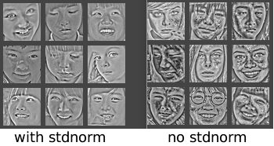

本篇主要讨论一些常用的数据归一化方法，以及其相应的影响。这里全部基于2-d的图像来讨论。          
     

#### __Range Normalize__
---    
* [-1，1]    
$$
x = \frac{2x - (max+min)}{max-min} 
$$     
* [0, 1]    
$$
x=\frac{x - min}{max-min}    
$$    
     
    
#### __DC Removal__
---
*  __原理__    
DC(dirrect current)来源于电子工程中的直流电。简单点的说就是移除本身的均值，其使得`整张图像的均值为0`，如下:    
$$
\hspace{8mm}\widetilde{I}(x,y) = I(x,y) - \frac{1}{W \times H}\sum_{x^{'},y^{'}}I(x^{'},y^{'}) \\
\hspace{16mm}其中:    \\ 
\hspace{20mm}公式中的第二项就是整张图像的均值
$$   
* __作用__    
coming soon    
     

#### __Mean Normalizetion__
---
*  __原理__    
均值归一化就是使`每个位置的像素的均值为0`(注意其和DC Removal的区别)。如下:    
$$
\hspace{8mm}\widetilde{I}(x,y) = I(x,y) - \mu(x,y) \\
\hspace{16mm}其中:    \\ 
\hspace{20mm}\mu(x,y) = \frac{1}{N}\sum_{n=1}^{N}I_n(x,y)
$$   
* __作用__    
coming soon    
     

#### __STD Normalizetion__  
---
*  __原理__    
标准差归一化就是使`每个位置的像素的均值为0且其每个位置像素的方差为1`(其就是在均值归一化后再除以每个位置像素的标准差)。如下:    
$$
\hspace{8mm}\widetilde{I}(x,y) = \frac{I(x,y) - \mu(x,y)}{\sqrt{var(x,y)}} \\
\hspace{16mm}其中:    \\ 
\hspace{20mm}var(x,y) = \frac{1}{N}\sum_{n=1}^{N}(I_n(x,y) - \mu(x,y))^2
$$   

为了抑制噪声，一般在方差上加上一个常数项，见文章[4]( __文章是减去单张图像的DC，并除以图像本身的标准差__ )。则公式变成如下形式:    
$$
\hspace{8mm}\widetilde{I}(x,y) = \frac{I(x,y) - \mu(x,y)}{\sqrt{var(x,y)}+const}  \\
$$     

* __证明__    
$$
\hspace{8mm}初始值 E[x] = u, V[x] = E[(x-u)^2] = \sigma^2 \\ 
\hspace{8mm}E[\frac{x-u}{\sigma}] = \frac{E[x]-E[u]}{\sigma} = \frac{u-u}{\sigma} = 0 \\
\hspace{8mm}V[\frac{x-u}{\sigma}] = E[(\frac{x-u}{\sigma})^2] - E[\frac{x-u}{\sigma}] \\
\hspace{24mm} = E[(\frac{x-u}{\sigma})^2]  \\
\hspace{24mm} = \frac{E[(x-u)^2]}{\sigma^2} \\
\hspace{24mm} = 1
$$    
     

#### __SCN(Spatial constractive Normalization)__  
---    
*  __原理__  
详细分析见renference[2]和[3]，其实就是`局部的标准化归一化`。其公式如下:     
$$
\hspace{8mm}\widetilde{I}(c,x,y) = \frac{V(c,x,y)}{max(const, \sigma_{x,y})}  \hspace{4mm}（1）\\ 
\hspace{16mm}其中: \\
\hspace{20mm}V(c,x,y) = I(c,x,y) - \sum_{c,x,y}W_{x,y}I_{c,x+p,y+q} \hspace{4mm} (2)\\ 
\hspace{20mm}c : 为通道索引  \\
\hspace{20mm}\sum_{c,x,y}W_{x,y} = 1 (一般取高斯核或每个权重都相等)  \\
\hspace{20mm}\sigma_{x,y} = \sqrt{\sum_{c,x,y}W(x,y)V^2_{c,x+p,y+q}}  \\ 
\hspace{20mm}const = mean(\sigma_{x,y})(此时这个值需要在一个大的数据集上计算出来或者直接取个常数如1)
$$    
* __细节__    
1.  `需要消除边缘效应`      
在式(1)和(2)中$$W_x,y$$应用在图像边缘时，其外面是补0的。因此边缘处的$$V$$与$$\sigma$$要较中间部分的小。可以乘以一个权重因子进行补偿    
2.  `在做SCN之前先做标准差归一化后，效果比较平滑，否则会有噪声`    
因为Std Norm将每个位置的数据方差归一化到了1，压制住了噪声，效果如下:    
  
`(平滑效果好还是带噪声的好，有待讨论。如作为分类的预处理，平滑是否会干掉太多的细节?)`  

     

#### __Reference__  
--- 
1.  [Natural Image Statistics](http://www.naturalimagestatistics.net/)(Chapter 5)           
2.  Pinto, Cox. Why is real-world vi- sual object recognition hard? 2008
3.  Lyu, Simoncelli. Nonlinear image representation using divisive normalization. 2008.
4.  Learning Feature Representations with K-means
