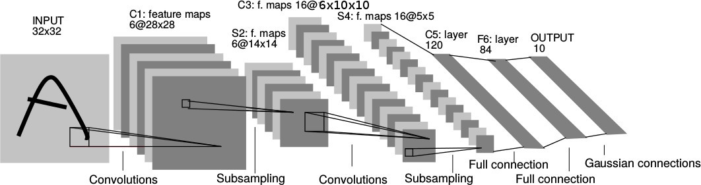

由[Yann LeCun](http://yann.lecun.com)于1998年在文章[1]中提出。CNN在层数比较多的情况下还能学习得到比较好的结果的原因，是因为CNN中`滤波核的共享大大降低了网路的复杂度`。其目前也是深度学习中研究比较多的，且效果比较好的模型。其传统结构如下图所示:    
    

* __说明__    
1. CNN由特征提取层(卷积层与采样层C1、S2、C3、S4)和分类层组成(全连接的C5、F6)    
2. 其C3中的有16x6个10x10滤波核，`即其滤波核的共享只是在一个map中`    
       

#### __Reference__
---    
1.    Gradient-Based Learning Applied to Document Recognition    

