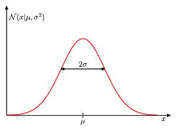

__Gaussian Distribution__
====
又称为 __Normal Distribution__，其中均值为0，标准差为1($$\mathcal{N}(x|0,1)$$)的正太分布又称为 __Standard Normal Distribution__    
 

__Univariate Formular__    
------    
---    
$$
\hspace{4mm}\mathcal{N}(x|\mu, \sigma^2) = \frac{1}{(2\pi\sigma^2)^{1/2}}exp\{-\frac{1}{2\sigma^2}(x-\mu)^2\}
$$     
    
     

__Multivariate Formular__    
------    
---  
当其为n维时，其形式如下:    
$$
\hspace{4mm}\mathcal{N}(\boldsymbol{x|\mu, |\Sigma|^{-1}}) = \frac{1}{(2\pi)^{n/2}|\Sigma|^{1/2}}exp\{-\frac{1}{2}\boldsymbol{(x-\mu)^T\Sigma^{-1}(x-\mu)}\}
$$     
     

__Properties__
------    
---        
$$
1. \hspace{4mm} \int_{-\infty}^{\infty} \mathcal{N}(x|\mu, \sigma^2)dx=1  \\
2. \hspace{4mm} E[x] = \int_{-\infty}^{\infty} \mathcal{N}(x|\mu, \sigma^2)xdx = \mu \\   
3. \hspace{4mm} E[x^2] = \int_{-\infty}^{\infty} \mathcal{N}(x|\mu, \sigma^2)x^2dx = \mu^2 + \sigma^2 \\    
4. \hspace{4mm} var[x] = E[x^2] - E[x]^2 = \sigma^2
$$    

