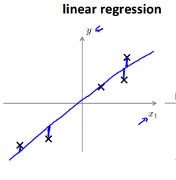

__Linear Regression__
==========
---- 
其也叫最小二乘。以2-D的线性回归为例，寻找其垂直方向上的距离和最短，如下图所示    
       

* __Hypothesis__      
$$
\hspace{4mm}h_{\boldsymbol{\theta}}(\boldsymbol{x}) = \boldsymbol{\theta^Tx} = \theta_0*x_0 + \theta_1*x_1 + ... + \theta_n*x_n  \\
\hspace{8mm}其中:\\
\hspace{12mm}x_0=1，即\theta_0为bias
$$    

* __Cost Function__    
使用[MSE](../criterion/squared_loss.html),其是 __convex__ 的 __（TODO其loss其实也是通过likehood推导出来的,见bishop）__    

* __Gradient__    
$$
\hspace{4mm}\frac{\partial L}{\partial \theta_i} = (t-h_{\boldsymbol{\theta}}(\boldsymbol{x}))*x_i
$$    

* __Solve__    
1. 可以用[Gradient Descent](../optim/gradient_descent.html)
2. [Normal Equation](../../math/linear-algebra.html#orthogonality)    
当加入[L2 regularization](../optim/regularization.html#l2)时，其等式变为        
$$
\theta = (X^TX + \lambda
\left( \begin{array}{title}
0 & & & &\\
& 1&  &&\\
& & .&&\\
& & &.&\\
& & &&1\\
\end{array} \right)
)^{-1} X^TT
$$    

* __Miscellaneous__      
1. 其也可以用来分类，如将目标设为1和0.此时的分界面为$$\boldsymbol{\theta^Tx} = 0.5$$. [^Ref1]

__References__
----------------    
---    
[^Ref1]: The Elements of Statistical Learning

