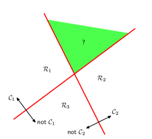
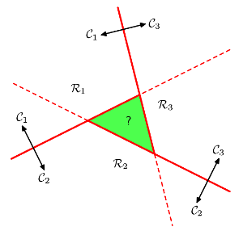
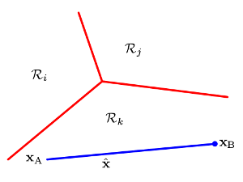

下面以3类问题为例进行解释    

*  __One Versus the Rest__       
也叫one_vs_all,其需要K-1个分类器，这个方法的不可分区域如下:    
    
     

* __One Versus One__       
其需要K(K-1)/2个分类器，这个方法的不可分区域如下:    
     
     
     
* __Single K-Class__    
上面的不可以分区域可以通过一个有K个分类面的分类器来解决，其由K个分类方程组成，即:    
$$
\hspace{4mm}y_k(x) = \boldsymbol{w_k}^T\boldsymbol{x} + w_{k0}
$$    
 
$$x属于C_k，当y_k(x) > y_j(x) \hspace{2mm}for\hspace{2mm}all\hspace{2mm} j \neq k时$$, $$C_k$$与$$C_j$$之间的分类面为$$y_k(x) = y_j(x)$$,每个决策区域是convex的(证明见bishop_PRML),其分类面如下:    
  
[softmax](./softmax_regression.html)就是一个K-class的分类方法     
 

####  __References__ 
---    
[bishop_PRML(chapter4.1.2)](http://research.microsoft.com/en-us/um/people/cmbishop/prml/)

 
