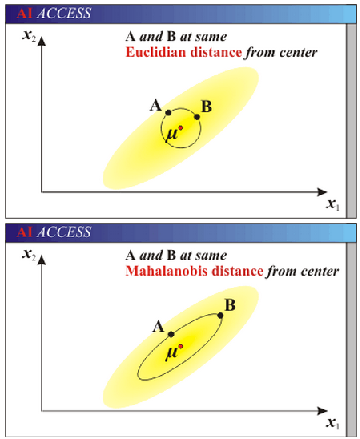

马氏距离又称为Statistical Distance，两点间的马氏距离定义如下：            
$$
\hspace{8mm}\d(p_1,p_2) = \sqrt{(p_1-p_2)^tS^{-1}(p_1-p_2)}     \\
\hspace{8mm}其中：    \\
\hspace{12mm}S为样本的协方差矩阵
$$       
    
* __与欧式距离的区别__      
    

* __属性__    
1. 马氏距离的优点是它不受量纲的影响，即与原始数据的测量量纲单位无关。       
2. 马氏距离还可以排除变量之间的相关性的干扰。    
3. 马氏距离的缺点是夸大了变化微小的变量的作用。    

