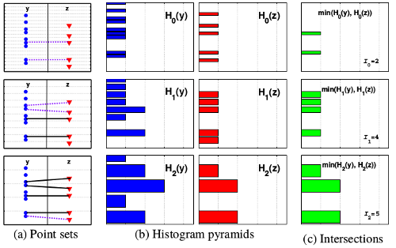
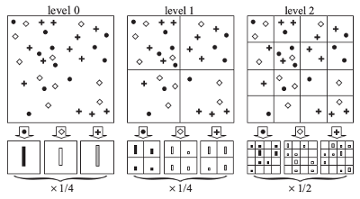

2006年由Kristen Grauman在文章[1]中提出来的算法,其适用于 __unordered、unequal length features__   

*  __Algorithm:__    
假设特征$$x\in R^{d \times m_x}$$,即为d维，且每一维的长度为$$m_x$$(每个特征的长度可以不一样),即:    
$$
\hspace{4mm}X = \{x | x = {[f_1^1,...,f_d^1];...;[f_1^{m_x},...,f_d^{m_x}]}\}
$$    
 
这里特征值必须为整数,假设特征值$$f \in (1，D)$$，这里直方图bin的宽度以 __2的倍数__ 增加，则直方图的分辨率$$L=log_2D$$，那么    
$$
\hspace{4mm}H_0(x)的直方图的bin宽度为1   \\
\hspace{4mm}H_l(x)的直方图的bin宽度为2^l，其维度为(\frac{D}{2^l})^d 
$$
 
则所有分辨率组合到一起的特征为:    
$$
\hspace{4mm}\Psi (x)=[H_{-1}(x),H_0(x),...,H_L(x)] \\
\hspace{8mm}(H_{-1}(x)只是为了占位，其实不存在)
$$    
 
则PMK的相似度定义如下:    
$$
\hspace{4mm}K(\Psi (x), \Psi (y)) = \sum_{i=0}^Lw_iN_i  \hspace{16mm}(1)\\
\hspace{8mm}其中:\\
\hspace{12mm}w_i=\frac{1}{2^i} \\
\hspace{12mm}N_i= I(H_i(x), H_i(y)) - I(H_{i-1}(x), H_{i-1}(y))  \\
\hspace{12mm}I(H_{-1}(x), H_{-1}(y))=0 \\
$$       
一维特征的PMK图形示例如下:            
  
 
__Normalized Version 1:__        
$$
\hspace{4mm}K_{normalize}(\Psi (x), \Psi (y)) = \frac{K(\Psi (x), \Psi (y))}{min(|x|_{1_norm}，|y|_{1_norm})} \hspace{16mm}(2)
$$    
 
__Normalized Version 2:__         
$$    
\hspace{4mm}K_{normalize}(\Psi (x), \Psi (y)) = \frac{K(\Psi (x), \Psi (y))}{\sqrt{K_{normalize}(\Psi (x), \Psi (x))*K_{normalize}(\Psi (y), \Psi (y))}}\hspace{16mm}(3)
$$    

*  __说明:__    
1.  $$I(H_i(x), H_i(y))$$为[Histogram Intersection](./histrogram_intersection.html).
2.  $$N_i$$需要减去前一层相交,因为前一层的相交在后一层中也相交 .
3.  $$w_i$$是根据直方图bin的个数来的。d维边长为$$2^i$$的超立方体点之间的最大距离为$$2^i\sqrt{d}$$ 。
因为i+1层的直方图的bin为i层的一半(即i+1层最大距离是i层的一半)，因此$$N_{i+1}$$的权重也为$$N_{i}$$的一半。
即直方图越精细其权重也越大
   
*  __补充说明:__     
文章中作者为了解决直方图量化时不同的偏移引入的问题，如下图:
    
作者在直方图量化时采用多次随机偏移来解决这个问题，即:    
$$
\hspace{4mm}\sum_{j=0}^TK(\Psi_j (x), \Psi_j (y))
$$    
 
   
#### __Spatial Pyramid Matching__
---    
2006年Svetlana Lazebnik在文章[2]中基于文章[1]提出引入空间的信息,即按照 __图像的位置信息__ 来量化直方图，方法如下:     
    
作者在这里引入M中类型的特征，且每个的类型的特征都是2-d的图像，则其公式如下:    
$$
\hspace{4mm}K = \sum_{i=0}^MK(\Psi (x_i), \Psi (y_i)) \hspace{16mm} (4)
$$    

*  __说明__    
1. 上图中M=3(圆形，菱形，加号)。
2. __理论上__ 可以将上面的PMK的特征$$x\in R^{d \times m_x}$$直接当成一个2-d的图像来量化，此时M=D.    
3. 特征的总维度为$$M\sum\limits_{l=0}^{L}4^l$$        
     
   
*  __Beyond BOW__  
文章中作者提出一种超过BOW的特征。基于很多子图像块使用聚类算法，先聚出如200个中心点(即M=200)。然后每幅图像进行二维扫描得到每个子块属于哪个类的索引。基于这个2-D的索引图，得到每个金字塔层的直方图。
 

#### __References__    
----    
1.  Pyramid Match Kernels: Discriminative Classification with Sets of Image Features
2.  Beyond bags of features: spatial pyramid matching for recognizing natural scene categories

