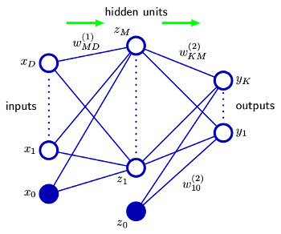

__Backpropagation of Neural Network__
========
本文采用的是2层(不包含输入层)的full-connect神经网路。Loss function使用squared error。且输出层的激活函数为线性函数，即`y=wx`。`只供自娱`    
 

__推导__
----------------    
---   
*  __网络结构__     
   

*    __Loss Function__         
$$
\hspace{4mm}E = \frac{1}{2}\sum_{k=1}^K（y_k-t_k）^2 \\ 
\hspace{8mm}其中:\\
\hspace{12mm}y_k = \vec z^T*\vec w^{(2)}_{k}   \\
\hspace{12mm}\vec z = (1, z_1,..., z_M)^T  \\
\hspace{12mm}z_m = h(\vec x^T*\vec w^{(1)}_{m}) \\
\hspace{12mm}\vec x = (1, x_1,..., x_D)^T  \\
$$     
    
*    __第二层推导__    
$$
\hspace{4mm}\boldsymbol{\frac{\partial{E}}{\partial{w_{k,i}^{(2)}}} = \delta^{(2)}_kz_i}  \\
\hspace{8mm}其中:\\
\hspace{12mm}\delta^{(2)}_k = (y_k-t_k)\\
$$    
      
*    __第一层推导__    
$$
\hspace{4mm}\boldsymbol{\frac{\partial{E}}{\partial{w_{m,i}^{(1)}}} = \delta^{(1)}_mx_i}  \\
\hspace{8mm}其中:\\
\hspace{12mm}\delta^{(1)}_m = h^{'}(\vec x^T*\vec w^{(1)}_{m})\sum_{k=1}^{K}\delta_kw^{(2)}_{k,m}
$$    
 

__References__
----------------    
---    
[bishop_PRML(chapter5)](http://research.microsoft.com/en-us/um/people/cmbishop/prml/)
