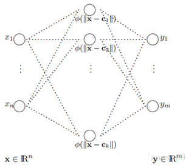

其结构如下图所示:    
        
$$
\phi(\mathbf{x-c}) = exp(-\frac{1}{2\sigma^2}||\mathbf{x-c}||^2)
$$       

网络的参数主要包括三种：`径向基函数的中心、方差和隐含层到输出层的权值`

* __训练__    
1. 通过非监督方法得到径向基函数的中心(`聚类`)和方差，通过监督方法（最小均方误差）得到隐含层到输出层的权值。
2. 所有参数都通过监督方法（最小均方误差）学习得到

