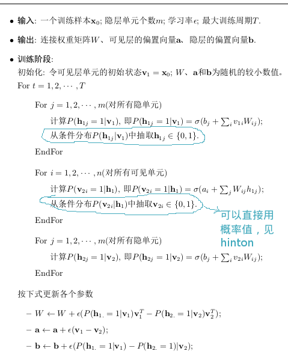

RBM是一个无向图(Undirected Graph)模型，其结构如下:    
    
     

#### __Bernoulli-Bernoulli RBM__
---    
* __RBM模型结构__   
此时`可视层节点`和`隐层节点`均为二值变量。即$$v_i \in \{0,1\}$$, $$h_i \in \{0,1\}$$，此时的 __能量方程__ 为:      
$$
\hspace{4mm}E(\mathbf{v,h}|\theta) = -\sum\limits_{i=1}^{n}a_iv_i - \sum\limits_{j=1}^mb_jh_j - \sum\limits_{i=1}^n\sum\limits_{j=1}^mv_iW_{ij}h_j    \\
\hspace{8mm}其中:  \\
\hspace{12mm}\theta = \{W_{ij}, a_i, b_j\} \\
\hspace{12mm}a_i为可视层的偏置(bias)     \\
\hspace{12mm}b_i为隐层的偏置(bias)     
$$     
则($$\mathbf{v,h}$$)的 __联合概率分布__ 为:    
$$
\hspace{4mm}P(\mathbf{v,h}|\theta)  = \frac{e^{-E(\mathbf{v,h}|\theta)}}{Z(\theta)}\\
\hspace{8mm}其中:  \\
\hspace{12mm}Z(\theta) = \sum\limits_{\mathbf{v,h}}e^{-E(\mathbf{v,h}|\theta)}
$$    
由于(v,h)是二值的因此计算$$Z(\theta)$$,需要$$2^{m+n}$$次计算，`其计算量太大无法在有效的时间内求得，因此其联合概率分布不可以直接求得`。     
因为隐层与可视层`层内无连接`, 因此每个节点是条件独立的，即:
$$
\hspace{4mm}P(h_j=1|v,\theta) = \sigma(b_j+\sum\limits_iv_iW_{ij}) \\ 
\hspace{4mm}P(v_i=1|h,\theta) = \sigma(a_i+\sum\limits_jW_{ij}h_j) \\ 
\hspace{8mm}其中:  \\
\hspace{12mm}\sigma(x) = \frac{1}{1+exp(-x)}
$$

* __基于对比散度的学习原理__     
通过最大化RBM在训练集上(样本数为T)的对数似然函数，学习得到参数$$\theta$$，即:     
$$
\hspace{4mm}\theta ^* = argmax\{L(\theta)\}    \\
\hspace{4mm}L(\theta) = \sum\limits_{t=1}^{T}logP(\mathbf{v}^t|\theta) = \sum\limits_{t=1}^{T}log\sum\limits_{\mathbf{h}}P(\mathbf{v}^t,\mathbf{h}|\theta) \\
\hspace{13mm} = \sum\limits_{t=1}^Tlog\frac{\sum_\mathbf{h}exp[-E(\mathbf{v}^t,\mathbf{h}|\theta)]}{\sum_\mathbf{v}\sum_{\mathbf{h}}exp[-E(\mathbf{v},\mathbf{h}|\theta)]} \\
\hspace{13mm} = \sum\limits_{t=1}^T(log{\sum_\mathbf{h}exp[-E(\mathbf{v}^t,\mathbf{h}|\theta)]}-log{\sum_\mathbf{v}\sum_{\mathbf{h}}exp[-E(\mathbf{v},\mathbf{h}|\theta)])} \\
$$    
使用梯度法求解上式时，上式对$$\theta$$的求导如下:    
$$
\hspace{4mm}\frac{\partial L}{\partial \theta} = \sum\limits_{t=1}^T\frac{\partial}{\partial \theta}(log{\sum_\mathbf{h}exp[-E(\mathbf{v}^t,\mathbf{h}|\theta)]}-log{\sum_\mathbf{v}\sum_{\mathbf{h}}exp[-E(\mathbf{v},\mathbf{h}|\theta)])} \\
\hspace{10mm}=\sum\limits_{t=1}^T\{\sum\limits_h(\frac{exp[-E(\mathbf{v}^t,\mathbf{h}|\theta)]}{\sum\limits_hexp[-E(\mathbf{v}^t,\mathbf{h}|\theta)]}\times\frac{\partial(-E(\mathbf{v}^t,\mathbf{h}|\theta))}{\partial\theta}) - \sum\limits_v\sum\limits_h(\frac{exp[-E(\mathbf{v},\mathbf{h}|\theta)]}{\sum\limits_v\sum\limits_hexp[-E(\mathbf{v},\mathbf{h}|\theta)]}\times\frac{\partial(-E(\mathbf{v},\mathbf{h}|\theta))}{\partial\theta})\} \\
\hspace{10mm}=\sum\limits_{t=1}^T(<\frac{\partial(-E(\mathbf{v}^t,\mathbf{h}|\theta))}{\partial\theta}>_{P(\mathbf{h|v}^t,\theta)} - <\frac{\partial(-E(\mathbf{v},\mathbf{h}|\theta))}{\partial\theta}>_{P(\mathbf{v,h}|\theta)}) \\
\hspace{4mm}\textbf{其中}: \\
\hspace{8mm}<.>_p 表示基于分布P的期望
$$      
用data和model来间记$$P(\mathbf{h|v}^t,θ)$$和$$P(\mathbf{h, v}|θ)$$这两个概率分布, 则(`当对某一个变量求偏导时，其他项就都被约掉了`)    
$$
\hspace{4mm}\frac{\partial logP(\mathbf{v}|\theta)}{\partial W_{ij}} = <v_ih_j>_{data}-<v_ih_j>_{model}\\
\hspace{4mm}\frac{\partial logP(\mathbf{v}|\theta)}{\partial a_{i}} = <v_i>_{data}-<v_i>_{model} \\
\hspace{4mm}\frac{\partial logP(\mathbf{v}|\theta)}{\partial b_{j}} = <h_j>_{data}-<h_j>_{model} \\
$$    
由上面知，联合概率分布不可求，因此上式中的第二项不可以直接求，可以通过[Gibbs采样](../foundation.html)来近似。但通常情况下需要使用较大的采样步数，这使得RBM的训练效率仍旧不高，2002年hinton于文章[2]中提出了`Constrastive Divergence`, 即使用重构的数据来近似联合分布      
$$
\hspace{4mm}\frac{\partial logP(\mathbf{v}|\theta)}{\partial W_{ij}} = <v_ih_j>_{data}-<v_ih_j>_{recon}\\
\hspace{4mm}\frac{\partial logP(\mathbf{v}|\theta)}{\partial a_{i}} = <v_i>_{data}-<v_i>_{recon} \\
\hspace{4mm}\frac{\partial logP(\mathbf{v}|\theta)}{\partial b_{j}} = <h_j>_{data}-<h_j>_{recon} \\
$$        
其训练的详细步骤如下:    
    
     

#### __Gaussian-Bernoulli RBM__
---   
见文章[3]，其能量方程如下:    
$$
\hspace{4mm}E(\mathbf{v,h}|\theta) = \sum\limits_{i=1}^{n}\frac{(v_i-a_i)^2}{2{\sigma}_i^2} - \sum\limits_{j=1}^mb_jh_j - \sum\limits_{i=1}^n\sum\limits_{j=1}^m\frac{v_i}{\sigma_i}W_{ij}h_j    \\
\hspace{8mm}其中:  \\
\hspace{12mm}\sigma_i为可视层节点i的高斯噪声的标准差     
$$     
1. 可以在训练之前，将样本进行[标准差归一化](../data_process/data-normalization.html#std-normalization)，这样$$\sigma_i$$就可以设为1    
2. 隐层重构可见层时，`直接用其线性的输出值，就不需要加激活函数了`    
3. 学习率要小一点，因为从隐层重构到可视层的值是`没界`的，会导致梯度值很大    
     

#### __Gaussian-Gaussian RBM__
---   
见文章[3]，其能量方程如下:    
$$
\hspace{4mm}E(\mathbf{v,h}|\theta) = \sum\limits_{i=1}^{n}\frac{(v_i-a_i)^2}{2{\sigma}_i^2} + \sum\limits_{j=1}^{m}\frac{(h_j-b_j)^2}{2{\sigma}_j^2} - \sum\limits_{i=1}^n\sum\limits_{j=1}^m\frac{v_i}{\sigma_i}W_{ij}\frac{h_j}{\sigma_j}    \\
\hspace{8mm}其中:  \\
\hspace{12mm}\sigma_i为可视层节点i的高斯噪声的标准差\\
\hspace{12mm}\sigma_j为可视层节点i的高斯噪声的标准差     
$$    
其模型`比较不稳定`，学习起来较困难    
     

#### __Reference__    
---    
1. 受限波尔兹曼机简介 张春霞
2. Training products of experts by minimizing contrastive divergence
3. A Practical Guide to Training Restricted Boltzmann Machines
