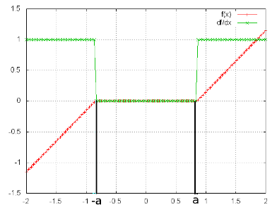

2009年的一篇文章1，主要用来求解线性逆问题，如$$Min_x\{|Ax-b|^2+\lambda|x|\}$$。[source code](https://github.com/torch/optim/blob/master/fista.lua)

#### __ISTA__   
---      
*  __前提:__     
目标函数可以写成$$min_x\{f(x) + g(x)\}$$，且f(x)和g(x)都是凸函数   
        
*  __推导:__   
求解$$Min\{f(x)\}$$时。梯度下降的迭代公式如下:       
$$
\hspace{8mm}x_k = x_{k-1} - t_k \nabla f(x_{k-1})  \hspace{8mm} (1)
$$       
 
式(1)可以写成如下形式:        
$$
\hspace{8mm}x_k = Min_x \{ f(x_{k-1}) + \nabla f(x_{k-1}(x-x_{k-1}) + \frac{1}{2t_k}(x-x_{k-1})^2 \}  \hspace{8mm}(2)\\
\hspace{16mm}当t_k=\frac{1}{f^{''}(x_{k-1})}，其就是泰勒公式展开
$$      
 
当求解 $$Min\{f(x) + \lambda|x|\}$$ 时，式(2)可以简单直接加上g(x)如下:        
$$
\hspace{8mm}x_k = Min_x \{ f(x_{k-1}) + \nabla f(x_{k-1}(x-x_{k-1}) + \frac{1}{2t_k}(x-x_{k-1})^2 + \lambda|x|\}  \hspace{8mm}(3)\\
$$  
 
去除式(3)中的常数项，可以写成如下形式:    
$$
\hspace{8mm}x_k = Min_x \{ \frac{1}{2t_k} |x-(x_{k-1} -t_k\nabla f(x_{k-1})^2| + \lambda|x|\}  \hspace{8mm}(4)\\
$$    
 
式(4)可以通过如下的方法来求解:    
$$
\hspace{8mm}x_k = \tau_{\lambda t_k}(x_{k-1} - t_k \nabla f(x_{k-1}))  \hspace{8mm}(5)\\
\hspace{12mm}其中\tau为收缩函数:      \\
\hspace{16mm}\tau_a(x) = \begin{cases} 
sign(x)(|x| - a) \hspace{8mm} |x|>a \\ 
0
\end{cases}
$$  
收缩函数曲线如下图所示:    
    

*  __实现:__    
ISTA其实就是使用公式(5)进行迭代求解。在实际使用中每次迭代需要寻找一个合适的$$t_k$$。$$t_k$$一般使用 __line search__ 的方法，即:    
先设定一个初始值$$t_k$$, 当使用$$t_k$$更新后的结果不符合下面的条件时，不断的减小$$t_k$$的值只到其符合如下的条件:    
$$
f(x_k) <= f(x_{k-1}) + \nabla f(x_{k-1}(x-x_{k-1}) + \frac{1}{2t_k}(x-x_{k-1})^2
$$    
     

#### __FISTA(Fast Iterative Shrinkage-Thresholding Algorithm)__ 
---    
FISTA即在ISTA的基础上使用[NAG momentum](../neural_network/nn-train-tricks.html#momentum)
      

__References__
---------    
---    
1. A Fast Iterative Shrinkage-Thresholding Algorithm for Linear Inverse Problems

