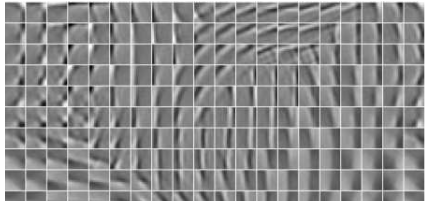
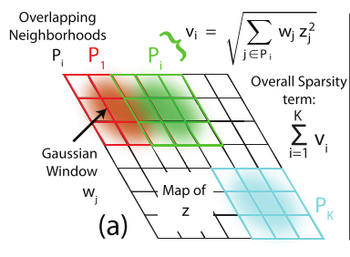
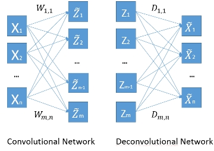

__PSD(Predictive Sparse Decomposition)__
========
今天的主题是08-11年比较火热的sparse coding。今天谈的算法是[Yann LeCun](http://yann.lecun.com)组[Koray](http://koray.kavukcuoglu.org/index.html)
的PSD(Predictive Sparse Decomposition)系列算法。其主要的贡献是在`推断过程中不需要再来求解`其稀疏表达，而是使用`推断函数来得到近似的稀疏表达`。

__Sparse Coding__
-------    
---   
传统Sparse Coding的求解过程如下：    
$$
\hspace{8mm}min\hspace{4mm}|Z|_0 \hspace{4mm} s.t. \hspace{4mm} x=DZ     \hspace{8mm}(1)\\
\hspace{16mm}\textbf{其中:}  \\
\hspace{20mm}x \in R^n为输入信号  \\
\hspace{20mm}Z \in R^m为稀疏编码系数  \\
\hspace{20mm}D \in R^{m\times n}为基也称为字典\\
$$    
由于$$l^0_{norm}$$求解太过复杂，因此采用$$l^1_{norm}$$替代。文章[5]与[Convex Optimization](http://stanford.edu/~boyd/cvxbook/)一书中证明了，$$l^1_{norm}$$具有同样的效果。因此其求解形式编程了如下形式(`Basis Pursuit Denoising`)：    
$$
\hspace{8mm}min\hspace{4mm}L(x,Z;D) = \frac{1}{2}|x-DZ|^2_2 + \lambda|Z|_1\hspace{8mm}(2)\\
$$    
基于样本集学习的时候，一般是先固定D学习Z，然后再固定Z学习D，如此反复迭代只到收敛。`推断时，固定D，通过式(2)求解不同样本的Z，在推断时进行求解显然性能上不允许`    
     

__PSD(Predictive Sparse Decomposition)__    
-------    
---   
PSD是由[Koray](http://koray.kavukcuoglu.org/index.html)2008年在文章[1]中提出的。其主要的思想就是在式(2)后面加上一个推断函数。其cost function如下：    
$$
\hspace{8mm}L(x,Z;D,P_f) = |x-DZ|^2_2 + \lambda|Z|_1 + \alpha|Z-F(x;P_f)|^2_2 \hspace{4mm}(3)\\
\hspace{16mm}\textbf{其中:} \\
\hspace{20mm}F(x;G,W,B) = Gtanh(Wx+B) \\
\hspace{20mm}P_f指的是参数{G\in R^{m\times m}的对角矩阵,W\in R^{m\times n},B\in R^m}\\
$$    
__学习时__    

1.  当$$\alpha=0$$时,式(3)变成了式(2)。这样先学习得到D、Z。然后再学习得到推断函数的参数    
2.  当$$\alpha>0$$时,学习步骤先固定$$P_f$$与D，学习Z，然后在固定Z学习$$P_f$$与D。如此反复迭代只到收敛(作者使用梯度下降进行学习)。        

__推断时,有两种方法求解Z__    

1.  固定B与推断函数，根据式(3)使用梯度下降迭代的求解Z    
2.  `直接使用推断函数F(x;G,W,B)`    
        

__Topographic PSD__
-------    
---   
2009年[Koray](http://koray.kavukcuoglu.org/index.html)在文章[2]中基于文章[1]引入了地形学`(即相似的特征组织在一起)`属性。如下图所示:    
    
其主要思想就是将式(3)中`第二项`Z的$$l^1_{norm}$$约束`变成了一种含有2维性质的约束`。如下图所示：    
     
其中有K个重叠的采样窗口(每个为$$P_i$$)，$$W_i$$是`固定的高斯分布值`。    
因此最终式(3)变成了如下式(4):    
$$
\hspace{8mm}L(x,Z;D,P_f) = |x-DZ|^2_2 + \lambda\sum_{i=1}^{K}v_i + \alpha|Z-F(x;P_f)|^2_2 \hspace{4mm}(4)\\
$$    
学习步骤以及推断同上面的PSD。__通过作者的实验获得以下一些信息__。      
  
1.  学习得到的字典D和推断函数中的参数W，`都拥有地形学的属性`    
2.  字典B与推断函数分开学习(即上面PSD学习时的第一种情况$$\alpha=0$$)，`会导致的推断函数的近似结果不够稀疏,且训练时间加长`    
     

__Convolutional PSD__
-------    
---   
2010年[Koray](http://koray.kavukcuoglu.org/index.html)在文章[3]中提出的。其主要解决了如下两个问题:    

1.  一般的sparse coding都是基于图像中的小块(patch)来做的。即上面公式中的`Y`是图像中的随机子块。本文采用整张图像,参考之文章[4]
2.  传统的sparse coding求解时，还要去求稀疏表达。本文才用上面的推断函数来进行表达    

其cost function如下:        
$$
\hspace{8mm}L(x,z,D,W) = \frac{1}{2}|x- \sum_{k=1}^KD_k*z_k|_2^2 + \lambda|z|_1 + \alpha\sum_{k=1}^K|z_k - f(W_k*x)|_2^2 \\
\hspace{16mm}\textbf{其中:}\\
\hspace{20mm}* 表示卷积\\
\hspace{20mm}x \in R^{w\times h} \\
\hspace{20mm}D_k \in R^{s\times s}  \\
\hspace{20mm}z_k \in R^{(w-s+1)\times (h-s+1)} \\
\hspace{20mm}W_k \in R^{s \times s} \\
\hspace{16mm}\textbf{注意:}\\
\hspace{20mm}1)公式中第一项D_k*z_k用的是卷积模式是\textbf{full}模式 \\
\hspace{20mm}2)公式中第三项W_k*x用的是\textbf{valid}模式\\
\hspace{20mm}3)\textbf{公式中的图像可以是多通道的} \\
$$        

__应用:__         

1.  训练好的推断函数f的输出可以直接当作z的近似表达。作为分类case下的特征来使用    
2.  上述方法可以用来作为[CNN](./cnn.html)中卷积核的预学习。即将学习好的推断函数f的中W作为[CNN](./cnn.html)中滤波核的初始值。其结构如下:    
    
Convolutional network相当于公式中的`推断函数`。而Deconvolutional network相当于`公式中的第一项`    

__训练细节:__   
在Torhch中的开源代码用的是`FistaL1`与梯度下降的方法(Get more detail from [source code](https://github.com/koraykv/unsup))     
1. 固定D与W, 使用[FISTA](./fista.html)求解$$\frac{1}{2}|x- \sum_{k=1}^KD_k*z_k|_2^2 + \lambda|z|_1$$得到z    
2. 固定z，通过梯度下降基于$$\frac{1}{2}|x- \sum_{k=1}^KD_k*z_k|_2^2$$与$$\alpha\sum_{k=1}^K|z_k - f(W_k*x)|_2^2$$分别求解D与W    
3. __注意:__ 公式第一项与第三项中D与W还包含偏移
    
     

__Reference__
-------    
---     

1.  Kavukcuoglu, LeCun. Fast inference in sparse coding algorithms with applications to object recognition. 2008         
2.  Kavukcuoglu, LeCun. Learning invariant features through topographic filter maps. 2009     
3.  Kavukcuoglu, LeCun. Learning Convolutional Feature Hierarchies for Visual Recognition. 2010      
4.  Zeiler, Taylor, Fergus. Deconvolutional Networks. 2010    
5.  DL Donoho and M Elad. Optimally sparse representation in general nonorthogonal dictionaries via l1 minimization   
