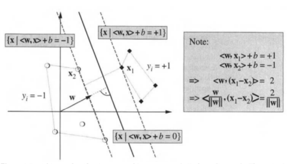
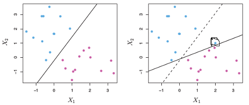

其有两种求解的方式：    

1.  __固定||W||=1，求最近样本到分类面的最大距离__    
$$
\hspace{4mm} \underbrace{Maximize}_{b,w_0,...,w_p} \{M\}  \\
\hspace{4mm} \textbf{Subject}\hspace{4mm} \textbf{to} :  \\
\hspace{8mm} ||W|| = 1 \\
\hspace{8mm} y_i(b + w_0x_{i0}+...+w_px_{ip}) \geq M \hspace{4mm}\forall i=1,...,n \\
\hspace{8mm} (y_i\textbf{为-1或者1})
$$       

2.  __固定最近样本到分类面的距离的尺度M=1，求最小||W||__    
    
$$
\hspace{4mm} \underbrace{Minimize}_{w_0,...,w_p} \{||W||\}  \\
\hspace{4mm} \textbf{Subject}\hspace{4mm} \textbf{to} :  \\
\hspace{8mm} y_i(\beta_0 + \beta_1x_{i1}+...+\beta_px_{ip}) \geq 1 \hspace{4mm}\forall i=1,...,n \\
\hspace{8mm} (\textbf{M的大小决定了W的尺度，M可以为任意正数})    
$$         

*  __特性__    
1. 在margine上的点称为`support vectors`
2. 只有`support vectors`会影响分类面。被margine正确分类的样本不影响分类面    
 
* __缺点__    
1. 很容易受到一些点的干扰，如下图右图中多了一个点以后，其分类面变化很大    
    
2. 不可以调整margin的大小，即在样本 `都分对的情况下` 容许M适当的变大。见下图的左图    
3. 当样本不可分的时候，其无法求解。见下图的右图    

#### __Reference__ 
---    
1. An Introduction to Statistical Learning (Chapter 9) 
2. Learning with kernels (page12)

