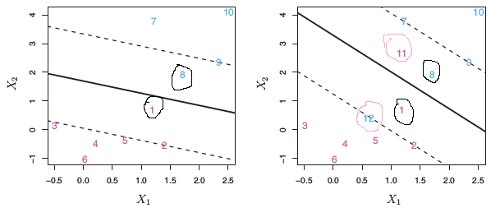

解决了[Maximal Margine Classifier](./mmc.html)的缺点。引入了`Soft Margine`。     

*  __原理__    
$$
\hspace{4mm} \underbrace{Maximize}_{\beta_0,...,\beta_p, \epsilon_1,...\epsilon_n} \{M\}  \\
\hspace{4mm} \textbf{Subject}\hspace{4mm} \textbf{to} :  \\
\hspace{8mm} \sum\limits_{j=1}^p\beta_j^2 = 1 \hspace{4mm}(\textbf{j从1开始，不包含}\beta_0)\\
\hspace{8mm} y_i(\beta_0 + \beta_1x_{i1}+...+\beta_px_{ip}) \geq M(1-\epsilon_i) \hspace{4mm}\forall i=1,...,n \\
\hspace{8mm}\epsilon_i \geq 0,  \hspace{4mm}\sum\limits_{i=1}^n\epsilon_i\leq C  \hspace{4mm}\epsilon_i称为松弛变量(slack\hspace{4mm}variable)
$$        

*  __特性__    
1. 训练集中被分错的样本的个数不可能大于C    
2. 当C=0时，就是[Maximal Margine Classifier](./mmc.html)
3. 此时有两种分错的样本，`margine分错`与`hyperplane分错`。所有`这些分错的与margine上的样本统称为support vectors`，如下图右图中(1,2,4,8,9,11,12)    

4. 只有`support vectors`会影响分类面。被margine正确分类的样本不影响分类面.  
     

#### __Reference__   
---    
1. An Introduction to Statistical Learning (Chapter 9) 

