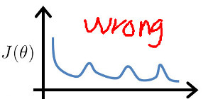
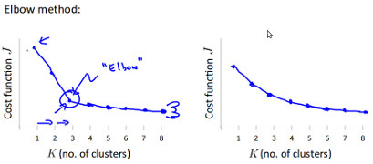

__K-Means__
----    
---   
* __loss function__    
$$
\hspace{4mm}J(c^{(1)}, ..., c^{(M)}, u_1, ..., u_K)＝\frac{1}{2M}\sum\limits_{i=1}^{m}{|x^{(i)} - u_{c^{(i)}}|^2} \\
\hspace{8mm}其中:
\hspace{12mm}u_k 是聚类中心点的位置 \\ 
\hspace{12mm}c^{(m)} 是第m个样本其归属类的索引（1-K）
$$    
其目标函数每次迭代完必须是下降的，否则代码有 __bug__ , 如下图:    
      
     
* __EM Train__    
1. 随机选择K个聚类中心点（$$u_1,..u_k ...u_K$$）(cluster centroids)    
一般做法是从训练样本中随机抽取K个样本作为聚类中心点      
2. 找到每个训练样本其最近的聚类中心点$$u_k$$，并将其归属到第k类
最近点通过$$min_k|x-u_k|^2$$ 计算
3. 将每个类中的样本求均值， 将其均值点当成新的聚类中心点
4. ''repeat 2,3 until convergence''    
     
* __Tips__    
1. 避开局部最小(Local optimal)
K-means的结果严重依赖与初始化的聚类中心点。    
a. 类比较少的情况， 如2-10个类，可以通过随机多次初始点进行多次训练选取最小的J作为最终的解决方案    
b. 类比较多的情况， 如100个类，随机多次训练就不合适了，__TODO: 解决方案__        
2. 在上面的第2，3步中， 可能有的类中没有样本， 这样就没法计算平均位置     
a. 传统做法，将这个类删除，这样就只有K-1个类了    
b: 重新进行初始化，再开始训练    
3. 类多的J肯定比类少的J要小， 否则类多的一定是收敛到了local optimal       
     
* __set K__    
1. elbow method, 通过拐点来寻找，通常情况下 __工作得不是很好__ ,因为其图形多数情况下，更像右边没有拐点    
    
2. 根据需要来设定类的个数
