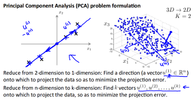
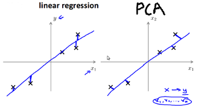

PCA在图像与信号处理中应用非常广泛。主要用来进行降维与一些预处理。PCA处理后`新的特征之间的将不相关性，即新的数据的协方差矩阵为对角阵`。PCA可以理解为寻找一些表达了数据最大方差的线性特征。
目标函数如下：        
$$
\hspace{8mm}{Max}_W \hspace{6mm} var[\sum_{x,y}W(x,y)I(x,y)]  \hspace{6mm} (1)\\
\hspace{16mm} 其中:  \\
\hspace{20mm} W(x,y)所要求的一个主要成分，且||W(x,y)||_2  = 1  \\
\hspace{20mm} I(x,y)表示的是原数据 \\
\hspace{20mm} \sum_{x,y}W(x,y)W_j(x,y) = 0 \hspace{4mm}(W_j(x,y)为前面通过式(1)求得的主要成分) 
$$   
       
     
#### __Solve__  
---      
上面的优化问题可以通过数据的[协方差矩阵](../foundation/expectation_variance_covariance.html#covariance)的[特征值分解](../../math/linear-algebra.html#eigenvalues-and-eigenvectors)来计算。步骤如下:         

1.  计算数据的协方差矩阵M`(如果各维度特征的量纲不在一个级别，可以除以标准差进行归一化,不会改变特征值，一般图像处理中不进行归一化)`，并计算协方差矩阵的特征向量矩阵U和特征值$$\lambda$$`(特征值的对角矩阵也是PCA旋转后协方差矩阵)`
2.  将数据进行PCA投影，即$$X_{pca}=U^TX_{ori}$$    
     

#### __Dimension Reduction__  
---  
*  __降维度操作__    
即去除一些特征值比较小的特征向量进行PCA转换。 如下:    
$$
\hspace{8mm}X_{pca}=U_{part}^TX_{ori}    \\
\hspace{16mm}其中:    \\ 
\hspace{20mm}U_{part} \in R^{n*k}    \\
\hspace{20mm}X_{roi} \in R^{n*1}  \\
\hspace{20mm}X_{pca} \in R^{k*1}    \\  
$$ 
     
*  __维度的选取__    
假如需要降维后的数据`保留原数据99%的方差`,即    
$$
\hspace{8mm}\frac{\frac{1}{m}\sum_{i=1}^{m}||x^{(i)}-x^{(i)}_{approx}||^2}{\frac{1}{m}\sum_{i=1}^m||x^{(i)}||^2}  \le 0.01  \\
\hspace{16mm}其中:    \\ 
\hspace{20mm}x_{approx}为重建后的特征
$$        
通过协方差矩阵的特征值来计算,即    
$$
\hspace{8mm}\frac{\sum_{i=1}^K\lambda_i}{\sum_{i=1}^m\lambda_i} \geq 0.99(假设\lambda按降序排列)
$$    
      
*  __降维后重建__    
$$
\hspace{8mm}X_{approx} = U_{part}∗(U_{part}^T∗X)
$$     
因为是协方差矩阵是`对角矩阵`，所以U是正交矩阵。即$$U^TU=I$$。因此当没有进行降维时，数据是可以完全恢复的。      
         
*  __从统计的角度看降维__    
1.  `目标函数`        
以2D->1D为例，寻找一个方向向量$$\vec u$$,使得数据投影到方向向量上的距离和最短。如果是3D->2D,则是寻找2个方向向量$$\vec u_1, \vec u_2$$, 因为两个向量可以组成一个平面, 如下图:     
    
2.  `其和线性回归的区别`     
线性回归是寻找其垂直方向上的距离和最短，而PCA是寻找其垂直投影到向量上的距离最短。如下图:    
        
        
*  __应用场景__     
1.  降维来减少内存的消耗，以及提高性能
2.  `不能使用PCA降维来防止数据过拟合`([Andrew NG的在机器学习公开课里有提到](https://class.coursera.org/ml-005/lecture/88)，但没说具体原因)。但其其实也可以作为一种regularization(见[3]p230，像L1、L2一样，表面上看其是降低了特征的维数，`但其实其限制是通过一些线性组合来约束原特征空间的参数`）     
       

#### __Whiten__
---  
详细见[here](./whiten.html)

#### __Reference__
--- 
1.  [Natural Image Statistics](http://www.naturalimagestatistics.net/)(Chapter 5)           
2.  [Machine Learning open course](https://www.coursera.org/course/ml)      
3.  An Introduction to Statistical Learning
