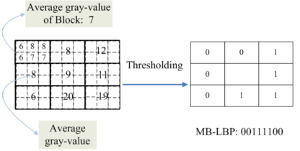

最近在做一个比较经典的项目`人脸检测`。对就是人脸检测。一个不能做得太差的项目。因为现在的技术已经非常成熟，且开源的效果也是很好（如OpenCV）。目前基于Adaboost的Cascade算法应该算是权威的做法（并使用积分图进行加速）。开山之作`Paul Viola&&Micheal.J.Jones`的`Robust Real-Time Face Detection`。下面就基于Adaboost的Cascade算法进行展开。    

__特征__
---------    
---  
*  __Haar-like__    
Haar特征比较简单，可以使用积分图加速。这里捎带提2点    
1.  使用45度倾斜的Haar特征(也可以使用积分图)，见文章`An Extended Set of Haar-like Features for Rapid Object Detection
2.  光照矫正。一般使用标准差归一化，公式如下：    
$$\overline{I(x,y)} = \frac{I(x,y) - u}{c\sigma} $$    
__a).__  c为常数，我取的是1。在45度倾斜的haar特征中，作者用的是2。      
__b).__  `均值u不用减，因为Haar-like特征就是检测窗内对应块做减法，可以抵消掉。`即$$(v_1-u)-(v_2-u)=v_1-v_2$$。    
__c).__  标准差通过公式$$\sigma=\sqrt{E(x^2)-E(x)^2}$$求解，这样由$$I(x,y)^2$$和$$I(x,y)$$的积分图，可以快速计算出任意位置检测框的标准差。    
*  __MBLBP__   
请参考`Face Detection Based on Multi-Block LBP Representation`。其主要思想如下图：
      
1.  传统的LBP是用单个像素值来进行比较。而MBLBP使用每个块中的像素平均值来比较。`每个块的像素值的和可以通过积分图来计算，因此速度也很快`.     
2.  `与Haar-Like不同的是，其不需要进行光照的归一化，因为LBP本身就抗光照`
3.  `另一个比Haar-like有优势的地方是，其在同一大小的检测框内，其所有类型的特征数量要比Haar少的多，因此训练时需要的内存要小很多`

__Cascade__
---------    
---    
*  __前几层分类器的弱分类器的个数要尽量少一点__    
目的是要用前几层在较少的时间内把尽量多的负样本给干掉，只让少数的样本跑完所有检测器。`因此前几层用来学习的负样本的纹理要尽量简单，如白板等`
*  __Feature-centirc__     
请参考`Feature-Centric Evaluation for Efficient Cascaded Object Detection`    
*  __合并相同的特征__    
`Face Detection with the Modified Census Transform`    
*  __FloatBoost__    

__Open Source__    
--------    
---    
* [OpenCV Train Cascade](../opencv)

